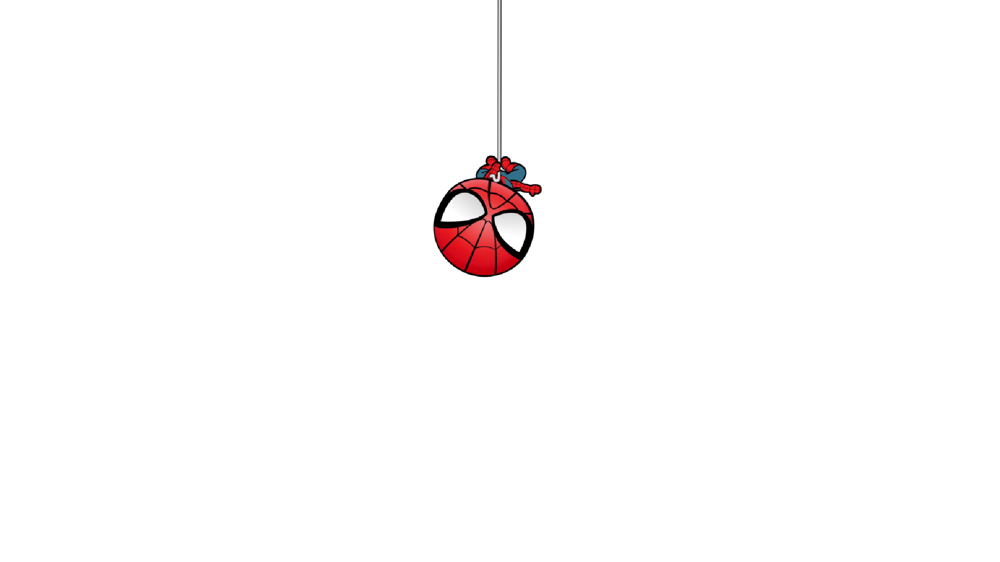

# 钉钉 MJ 彩蛋 (桌面版)

在**钉钉 PC 客户端**里自己发送 `mj`、`mjmj`、`MJ`、`MjMj` 等组合时，全屏播放带透明通道的蜘蛛侠动画——复刻 iOS 越狱插件 [qiu7c/Tiktok-MJ-for-Wechat](https://github.com/qiu7c/Tiktok-MJ-for-Wechat)（抖音 MJ 蜘蛛侠彩蛋）的效果。

动画窗口**点击穿透、不抢焦点**，不影响打字和聊天；原版音效同步播放；播完自动消失。



## 快速开始

**方式一（推荐）**：双击 `dist\MJDingTalk.exe`，或双击 `启动彩蛋.bat`（优先启动 exe）。

**方式二（源码运行）**：

```bat
pip install PyQt6 uiautomation pywin32 Pillow
python main.py
```

启动后驻留在系统托盘（红底 MJ 图标）：右键菜单有 **启用/停用彩蛋、播放测试、关于、退出**。
"关于"窗口展示应用图标、名称、版本号（v1.2.0）和开发者，**深浅色跟随系统**并实时切换。

在钉钉任意聊天输入框输入 `mj`（或 `mjmj`/`MJMJ`…）按回车发送，动画即播。两段动画自动交替，并按素材构图锚定角落：**坠落**贴屏幕**右上角**，**荡绳**贴屏幕**左上角**（荡绳素材的蛛丝悬挂点在画面左边界之外，贴左播放才能与屏幕边缘自然衔接）。原视频音效同步播放。

## 打包为 exe

```bat
双击 build_exe.bat
```

或手动：

```bat
pip install pyinstaller
python -m PyInstaller --noconfirm --clean --noconsole --onefile --icon assets/app.ico --add-data "assets;assets" --name MJDingTalk main.py
```

产物为 `dist\MJDingTalk.exe`（单文件、无终端窗口，约 78MB）。素材打包在 exe 内部；**config.json 和日志生成在 exe 旁边**（首次运行自动创建），想改配置就改 exe 旁边那份。onefile 首次启动需解压，等 1~3 秒属正常；如被杀软拦截，添加信任即可。

## 触发规则（与原项目一致）

长度为偶数且每 2 个字符一组均为 "mj"（不区分大小写）：

| 输入 | 结果 |
|------|------|
| `mj` / `MJ` / `Mj` | ✅ 触发 |
| `mjmj` / `MJMJ` / `MjMj` | ✅ 触发 |
| `mjm` / `mjx` / `ajmj` | ❌ 不触发 |
| 中文/其他文字 | ❌ 不触发 |

只触发**自己发送的**消息（对方发的 mj 不触发）。历史消息天然不涉及——检测的是"你正在发送"这个动作。

**中文输入法行为**：中文模式下输入 `mj` 再按回车，只是把字母"上屏"进输入框（消息并未发送），**不会触发**；再按一次回车真正发送出去（输入框被清空）时才触发。判定原理：触发必须同时满足"输入框命中过触发词 + 输入框被清空 + 发送键刚按下"三个条件，"清空"是消息真正发出的唯一可靠信号。

## 工作原理

原项目 Hook 微信私有类消息函数实现"生产者(pending)-消费者(渲染)两段式"；桌面版没有注入条件，等价替换为：

```
键盘钩子(WH_KEYBOARD_LL)                 UIA 轮询(60ms)
  Enter / Alt+S 按下 ──┐                  钉钉前台时读输入框 Value
                       v                        v
              [路径A·即时] 读输入框文本 ──命中──> 触发
              [路径B·兜底] "命中过触发词→输入框被清空→发送键刚按下" ──> 触发
                                                      |
                                          PyQt6 透明点击穿透全屏窗口
                                          QMovie 播放带 alpha 的动画 WebP
```

- **路径 A**：Enter 瞬间立即读输入框，命中即播（零竞态，最快）
- **路径 B**：兜住"钉钉先清空输入框后我们才读到"的竞态，以及点击发送按钮的场景
- 全程**只读**前台窗口名、输入框文本和键盘事件流，**不注入钉钉进程、不模拟点击、不自动发消息**
- 4 秒冷却防止连发刷屏；播完自动销毁窗口 + 30 秒看门狗兜底回收

素材制作与原项目相同：仓库内的双画面蒙版源视频（左灰度蒙版+右彩色画面）经 ffmpeg `alphamerge` 合成带透明通道的画面。注意**不能直接用 ffmpeg 的 webp muxer 一步转动画 WebP**——libwebp 动画编码器对透明背景做子矩形增量编码，旧位置的图案不会被擦除，播放时会叠成一串（实测踩坑）。正确做法是先逐帧导出 PNG，再用 Pillow 以"全帧替换"（`disposal=2`）组装动画 WebP：

```bash
# 1. 逐帧导出 PNG (带 alpha)
ffmpeg -i assets_src/mj-drop-dual-mask.mp4 -filter_complex \
"[0:v]split[x][y];[y]crop=iw/2:ih:0:0,format=gray[m];[x]crop=iw/2:ih:iw/2:0[c];[c][m]alphamerge,format=rgba[out]" \
-map "[out]" build_frames/drop_%03d.png

# 2. Pillow 组装 (帧时长 33ms, 全帧替换)
python -c "
from PIL import Image; import glob
fs = [Image.open(f).convert('RGBA') for f in sorted(glob.glob('build_frames/drop_*.png'))]
fs[0].save('assets/mj-drop-alpha.webp', save_all=True, append_images=fs[1:], duration=33, loop=0, disposal=2, minimize_size=False, quality=85, method=4)
"
```

## 配置 (config.json)

| 键 | 默认 | 说明 |
|----|------|------|
| `enabled` | `true` | 启动时是否启用 |
| `process_names` | `["DingTalk.exe"]` | 只在这些进程前台时生效 |
| `poll_interval_ms` | `60` | 输入框轮询间隔 |
| `cooldown_s` | `4.0` | 两次播放最小间隔 |
| `overlay_height_ratio` | `0.85` | 动画高度占屏幕高度比例 |
| `volume` | `1.0` | 音效音量（0.0~1.0，改 0 可静音） |
| `ignore_injected_keys` | `true` | 忽略软件注入的按键(按键精灵等不会误触发)；真实键盘不受影响 |
| `fallback_vk_buffer` | `true` | 输入框 UIA 不可读时的键盘缓冲兜底 |

## 已验证

- ✅ 钉钉 8.5.5 实测：真实发送 `mj`/`mjmj` 两条检测路径均触发、动画交替播放、自动关闭
- ✅ 触发词规则、冷却防重、多实例互斥
- ✅ 真实屏幕透明合成渲染（截图目检）
- ✅ 素材无叠影：源视频逐帧比对 + PIL/ffmpeg 双解码器验证单帧干净

## 已知边界

- 需要**当前会话窗口在前台**且能定位到聊天输入框（钉钉独立聊天窗口同样支持）
- 用鼠标点"发送"按钮发送 mj：走路径 B，可触发（前提是之前 1.2 秒内输入框被轮询命中过）
- 钉钉大版本更新可能改变控件类名，届时调整 `config.json` 的 `input_control_class`
- 纯只读检测，账号风控风险低，但请理性使用

## 目录结构

```
MJ-DingTalk/
├── main.py            # 入口: 托盘 + 装配
├── config.json        # 配置 (exe 旁边会自动生成同名文件)
├── build_exe.bat      # 一键打包 exe
├── 启动彩蛋.bat       # 优先启动 exe, 无则源码运行
├── mjegg/
│   ├── config.py      # 配置加载
│   ├── paths.py       # 源码/打包双形态资源与可写目录适配
│   ├── theme.py       # 深浅色跟随系统(实时切换)
│   ├── about.py       # 关于窗口(图标/名称/版本/开发者)
│   ├── matcher.py     # 触发词匹配(移植 MJMatches)
│   ├── foreground.py  # 前台窗口进程判断
│   ├── keyhook.py     # WH_KEYBOARD_LL 键盘钩子线程
│   ├── watcher.py     # 检测 worker(清空确认触发)
│   └── overlay.py     # 透明点击穿透播放窗口
├── assets/            # 带 alpha 的动画素材 + 音效 + 头像 + 图标
├── assets_src/        # 原始双画面蒙版源视频
├── dist/MJDingTalk.exe
└── poc/               # POC 与测试脚本
```

## 致谢与许可

动画素材与触发规则源自 [qiu7c/Tiktok-MJ-for-Wechat](https://github.com/qiu7c/Tiktok-MJ-for-Wechat)（iOS 越狱插件，原作者 qiu7c）。

本仓库代码以 [MIT](LICENSE) 协议开源；`assets/` 内素材版权归原作者/权利方所有，仅供学习交流。
